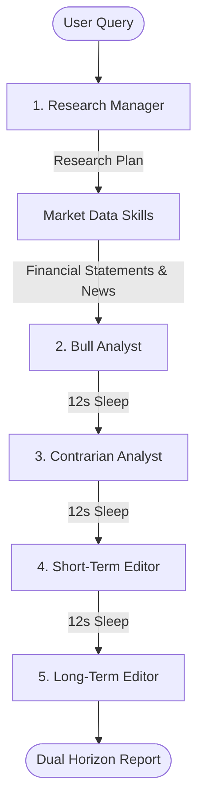

# Janus: Autonomous Investment Research Agent

Janus is a production-ready, 5-agent investment committee designed to automate stock research, leveraging the **AgentField Python SDK** and financial market data. 

To respect free-tier API rate limits (e.g., Gemini's 5 RPM/20 RPD ceilings), the pipeline is configured with a sequential throttled execution pattern.

---

## Architecture: The 5-Agent Committee



1. **Research Manager**: Decomposes user questions into structured hypotheses and focuses.
2. **Bull Analyst**: Gathers yfinance stats, balance sheets, cash flows, and news to build a rigorous bull thesis.
3. **Contrarian Analyst (Red Team)**: Devil's advocate scanning for negative indicators, regulatory risks, and short arguments.
4. **Short-Term Editor**: Synthesizes a 1–6 month outlook (buying pressure, catalysts, earnings).
5. **Long-Term Editor**: Synthesizes a 1–5 year structural outlook (competitive moat, long-term risks).

---

## Tech Stack
* **Backend**: Python (FastAPI, AgentField SDK, yfinance, litellm, python-dotenv)
* **Frontend**: Vanilla HTML / CSS / JS (Bloomberg Dark Terminal theme)
* **API Streaming**: Server-Sent Events (SSE) for real-time thought logs and status updates

---

## Setup & Running

### 1. Configure Keys
Create a `.env` file in the root folder:
```env
LLM_MODEL=gemini/gemini-2.5-flash-lite
GEMINI_API_KEY=your_gemini_api_key_here
PORT=8080
```

### 2. Install & Start
```bash
python -m venv venv
source venv/bin/activate
pip install -r requirements.txt
python src/main.py
```

### 3. Open UI
Navigate to `http://localhost:8080` in your web browser.
